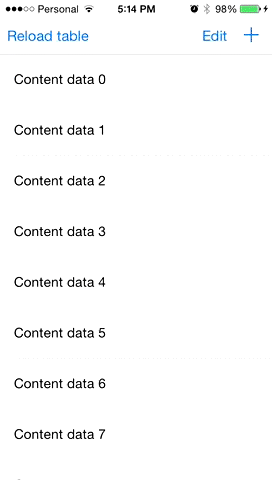

# PagedArray

## Extended features from the original forwk

* Reordering of the array
* Deleting elements from the array
* Appending new elements in the array
* Set an element in any index of the array

